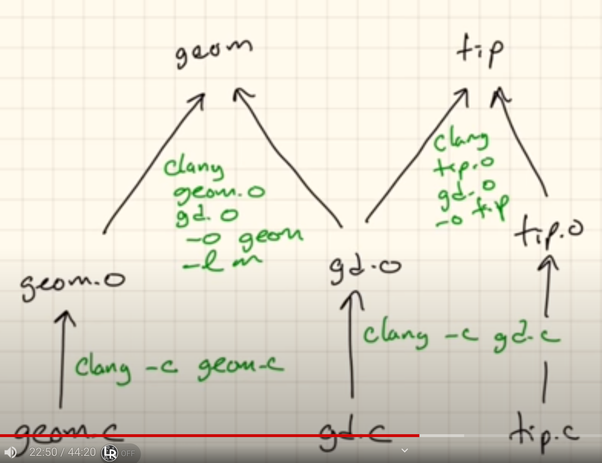

# Makefile

#### **What is the Makefile** 
[A][3] Makefile is one of the earliest build automation tool of software projects, used primarily in Unix and Unix-like operating systems. It is a text file which contains a set of rules and dependencies that specify how the project's source code files should be compiled and linked to create executables, libraries, or other output files. Makefiles are written in a simple scripting language and are processed by the `make` utility.

Makefiles are essential tools in `C`/`C++` projects for automating the build process. [Its][4] primary usage in the build automation from the source files (`.c` or `.cpp`) to object files (`.o`). By having separate `.c` or `.cpp` files, each one providing a specific functionality, can convert each file to a `.o` object file, and then link all these files together to create an executable file. **If we change we change one of these source file, we can just recompile that file in order to get this updated `.o` object file, and then link all the object files back together again. That is, we don't need to redo any work in the other object files whose source files remained untouchable**. It is a much faster and the best approach, and the `Makefile` helps developers to automate such tasks.

[However][15], in this context of having multiple `.c`/`.cpp` files, it is quite common to have situations in which a source file uses a function from another source file. It is where the header files comes in. One of its utility is to inform to the function prototypes/declarations that there exist into another source file(see `./c-header-files-for-func-prototypes/` in the `libraries-and-header-files` branch).

---

## `C`/`C++` system file structure


A good project file structure in C/C++ can help organize your code, make it more maintainable, and facilitate collaboration with others. *There isn't a one-size-fits-all structure, it strictly depends on how complex is your project*. Here's a suggestion:

```
  project_name/
│
├── bin/
│   └── (executable files)
│
├── build/ (or obj/)
│   └── (intermediate object files)
│
├── include/ (or headers/)
│   └── (header files)
│
├── lib/
│   └── (library files, if applicable)
│
├── src/ (or project_name/)
│   ├── main.c (or main.cpp. project_name can be used instead of main)
│   ├── module1.c (or module1.cpp)
│   ├── module2.c (or module2.cpp)
│   └── ...
│
├── tests/ (optional)
│   ├── test_module1.c (or test_module1.cpp)
│   ├── test_module2.c (or test_module2.cpp)
│   └── ...
│
├── docs/ (documentation)
│
├── CMakeLists.txt (if using CMake)
│
├── README.md (project documentation)
│
└── .gitignore (list of files to ignore in version control)
```

- `bin/`: This is where compiled executable files are placed after building.
- `build/`: Intermediate build files, such as object files, can be stored here. This directory is often generated by build tools.
- `include/`: Header files (`.h`) are placed here. This directory should be included in your compiler's include path.
- `lib/`: If your project involves creating libraries, you can place library files (`.a` or `.so`) here.
- `src/`: Source code files (`.c` or `.cpp`) for your project. The main entry point should be in the root of this directory.
- `tests/`: If you write unit tests for your code, you can place them here. This is an optional directory.
- `docs/`: Documentation for your project, which can include user guides, developer documentation, and more.
- `CMakeLists.txt`: If you use CMake for build automation, this file specifies how your project should be built.
- `README.md`: A README file with essential information about your project, including instructions on how to build and use it.
- `.gitignore`: A list of files and directories that should be ignored by version control systems like Git.

It's essential to choose a structure that fits your project's size and complexity. Smaller projects may not need as many directories, while larger projects may require additional directories for organization. Consistency in file naming and structure is key, especially when working with others or sharing your code.

---

## Example


### Performing it manually

To compile `tip`, run:
```
gcc -c tip.c
gcc -c gd.c
gcc -o tip tip.o gd.o
```

To compile `geom`, run:
```
gcc -c geom.c
gcc -c gd.c
gcc -o geom gd.o geom.o -lm
```

### Performing it by using `./Makefile`

Just run `make`


[1]: https://www.youtube.com/watch?v=GExnnTaBELk
[2]: https://www.learncpp.com/cpp-tutorial/header-files/
[3]: https://en.wikipedia.org/wiki/Build_automation
[4]: https://youtu.be/GExnnTaBELk?t=981
[5]: https://youtu.be/GExnnTaBELk?t=1402