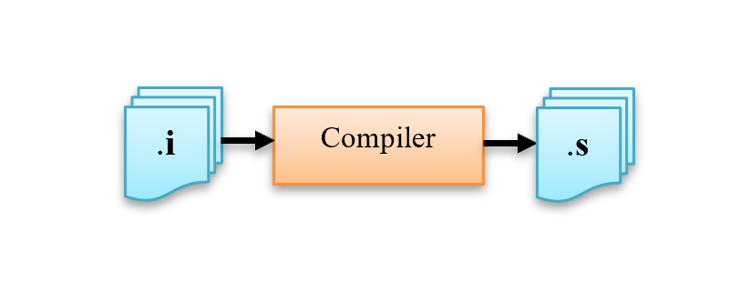
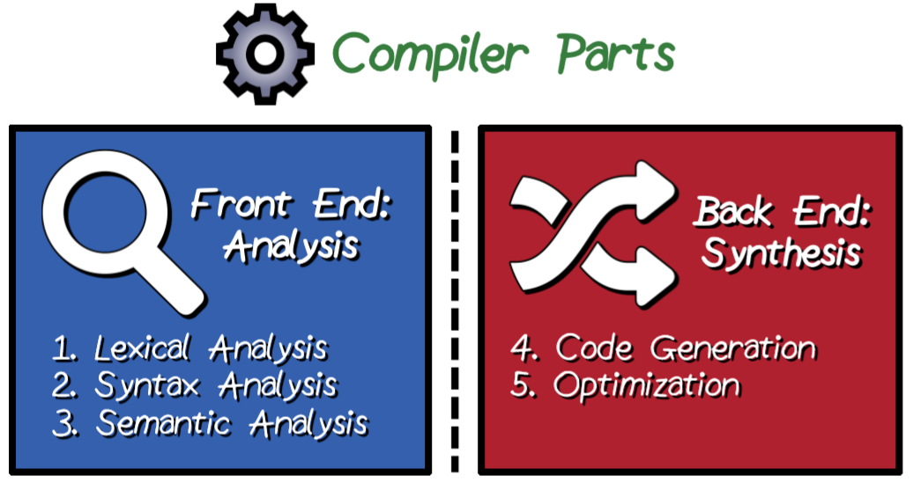
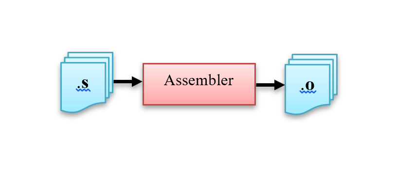
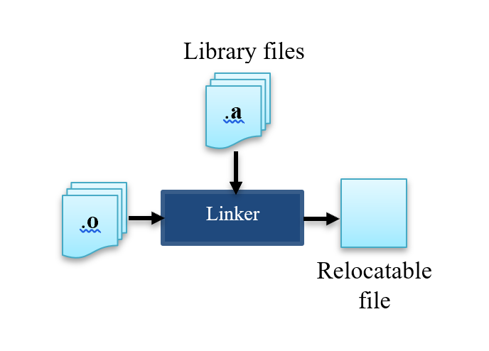

# Build process

**What is a compiler?**

C/C++ compilers are software tools that translate human-readable source code written in the C or C++ programming languages into [*machine languages*][10], that is, a set of instructions made of zeros and ones. This set of instructions are represented in the computer as an executable file that can run on a computer's hardware.

**What is the build process?**

Build process is a multi-stage process that includes
- Preprocessing
- Compiling
- Assembling
- Linking

The key step is the compilation phase, where the source code is analyzed, optimized, and translated into an intermediate representation known as assembly code (for `C`) or object code (for `C++`). The software that perform these processes tasks are called *compiler* (although compiling is just one of the steps performed by the compiler).

**What are the main `C`/`C++` compilers?**

- GCC (GNU Compiler Collection): One of the most widely used open-source compilers, GCC supports a variety of programming languages, including `C` and `C++`. It's available on multiple platforms, making it a popular choice for `C`/`C++` development.
  - `gcc`: The GNU `C` Compiler, which primarily compiles `C` code.
  - `g++`: The GNU `C++` Compiler, which compiles `C++` code.
Both `gcc` and `g++` are part of the GCC suite and are commonly used to compile `C` and `C++` programs on various platforms, including Unix-like systems (Linux, macOS, BSD), as well as Windows through tools like MinGW or MSYS2.
  - MinGW (Minimalist GNU for Windows): MinGW is a port of the GCC (GNU Compiler Collection) for Windows. It provides a GCC-based development environment on Windows.
Developers who prefer GCC and a more Unix-like development experience often use MinGW on Windows.
It is suitable for cross-platform development and can target various platforms, including Windows.
- Clang: Developed by the LLVM project, Clang is known for its fast compilation times and excellent diagnostics. It's often used as an alternative to GCC, especially in the `C++` community. On [macOS][2], the most commonly used `C`/`C++` compiler is Clang, which is part of the LLVM (Low-Level Virtual Machine) project. Clang has become the default compiler on macOS for `C` and `C++` development.
  - `clang`: `C` compiler
  - `clang++`: `C++` compiler
- Microsoft Visual `C++` (MSVC): MSVC is the compiler provided by Microsoft as part of Visual Studio. It's a primary choice for [Windows][4] development with `C++`.
- Intel `C++` Compiler: Intel's compiler is known for its optimization capabilities, especially for Intel processors. It's commonly used in high-performance computing (HPC) and scientific computing.

---

## Preprocessing


- [The][1] input file for this stage is `*.c` file.
- [The preprocessor][16] takes the source code as an input, and it removes all the comments from the source code.
- It performs [fours][15] tasks:
  - Inclusion of header files. [For][16] example, if the directive `#include <stdio.h>` is available in the program, then the preprocessor interprets the directive and replaces this directive with the content of the `/usr/include/stdio.h` file.
  - *Macro* expansion. A macro is a preprocessor directive that allows you to define a symbolic name or identifier for a sequence of code. They are used to create code snippets that can be easily reused and to introduce simple text substitutions. The most common use of macros in C is through the `#define` directive, which defines a macro. They can be [constant][17] macros, e.g., `#define BUFFER_SIZE 1024`, or [function-like][18] macros, e.g., `#define MAX(a, b) ((a) > (b) ? (a) : (b))`.
  - Resolve *conditional compilation*. Using special preprocessing directives, you can include or exclude parts of the program according to various conditions. For example, `#ifdef DEBUG printf("Debugging is enabled.\n"); #endif`. Other conditional compilatinos are `#if`, `#elif`, `#else`.
  - Line control. If you use a program to combine or rearrange source files into an intermediate file which is then compiled, you can use line control to inform the compiler of where each source line originally came from.
- In nutshell, the preprocessor expands the code.
- The output file is `*.i` or preprocessed file.

### Example

```
  gcc -E main.c -o main.i
```
- [The][15] option `-E` Stop after the preprocessing stage; do not run the compiler proper. The output is in the form of preprocessed source code, which is sent to the standard output (or to a file with the `-o` option).


### Compilation



- The input file for this stage is `*.i` file.
- [It][15] takes the output of the preprocessor and converts it to assembly language.
- Assembly code, often referred to as assembly language or just assembly, is a low-level programming language that uses mnemonic symbols (e.g., MOV for "move," ADD for "add") to represent CPU instructions, thus making the code human-readable. Each assembly instruction typically corresponds to a single machine code instruction that is specific to the target CPU. Therefore, Assembly code is highly platform-specific, meaning that it is tailored to a specific computer architecture and operating system. Code written in assembly for one type of CPU will not run on a different CPU architecture without modification.
- This code is exactly the same you could have worked with when programming some micontroller in assembly language.
``

- The first part of the compiler is called Front End: in which, the analysis of program syntax and semantics happens. First stage of the front-end part of the compiler is scanning the input text and Tokenization by identifying tokens such as keywords, identifiers, operators, and literals, then passing the scanned token to the parsing tool that ensures tokens are organized according to C rules to avoid compiler syntax errors. Second stage of the front-end of the compiler is checking if the sentence that has been parsed has the right meaning. And, this semantic check, if it fails you get a Semantic Error.
- The second part convert the code to assembly code. This conversion is not a one to one mapping of lines but instead a decomposition of `C` operations into numerous assembly operations.
- The output file is `*.s` or `*.asm` file.

### example

```
  gcc -S main.i -o main.s
```
- `-S`: Stop after the stage of compilation proper;

## Assembler



- The input file for this stage is `*.asm` or `*.s` file.
- If you use `gcc` to assemble the file, you must name the extension to `.s`. Otherwise, the `-c` option of `gcc` will try to link the file instead to assemble it.
- The assembler will convert the assembly code into lower-level intermediate representation, which is stored in the `.o` file, known as object file. This intermediate representation contains machine-level code, that is, non-human-readable instructions and data structures that represent the functions and variables defined in your code. The `.o` file is not the final executable code. It contains machine-readable instructions but is not directly executable by the operating system. It lacks some necessary information, such as the memory addresses of functions and variables, which is resolved during the linking phase.
- The output file is `*.o` or `*.obj` file.

### example

```
  gcc -c main.s -o main.o
```
Alternatively, you can run
```
  as main.s -o main.o
```

where `as` the the GNU assembler.

## Linking



- The input file for this stage is *.o file.
- The linker merges all the object code from multiple modules into a single one. If we are using a function from libraries, linker will link our code with that library function code.


### example

```
  gcc main.o -o myprogram
```

`myprogram` is an executable file.

[1]: https://www.linkedin.com/pulse/c-build-process-details-abdelaziz-moustafa/

[2]: https://medium.com/hayoung-techlog/setup-for-c-on-mac-d2056a025c85#:~:text=Oct%203%2C%202022-,Clang%20vs%20G%2B%2B,%2B%2B%20is%20GNU%20c%2B%2B%20compiler.

[4]: https://www.reddit.com/r/cpp/comments/3pe6j9/why_should_i_use_clang_over_g/

[5]: https://llvm.org/

[6]: https://stackoverflow.com/questions/5708670/llvm-vs-clang-on-os-x#:~:text=LLVM%20is%20a%20backend%20compiler,a%20representation%20suitable%20for%20LLVM.

[8]: https://en.wikipedia.org/wiki/LLVM

[9]: https://en.wikipedia.org/wiki/Just-in-time_compilation (?)

[10]: https://cplusplus.com/doc/tutorial/introduction/

[11]: https://en.wikipedia.org/wiki/Microsoft_Visual_C%2B%2B

[12]: https://www.learncpp.com/cpp-tutorial/introduction-to-the-compiler-linker-and-libraries/

[13]: https://www.learncpp.com/cpp-tutorial/introduction-to-programming-languages/

[14]: https://www.learncpp.com/cpp-tutorial/introduction-to-the-preprocessor/

[15]: https://www.linkedin.com/pulse/understanding-c-program-compilation-process-fernandez-barreto/

[16]: https://www.linkedin.com/pulse/explanation-all-steps-compilation-juan-diego-petter/

[17]: https://gcc.gnu.org/onlinedocs/cpp/Object-like-Macros.html

PS1: you will possibly merge the `2-compilation-objects-link` branch into this branch
PS2: if this branch becomes too extensive. you can break it down, e.g., `1-biuld-process:1-compilation`, `1-biuld-process:2-preprocessor`, etc...
PS3: for the code example, choose one of the followings
- https://www.linkedin.com/pulse/c-build-process-details-abdelaziz-moustafa/
- https://www.learncpp.com/cpp-tutorial/header-files/
- https://www.youtube.com/watch?v=GExnnTaBELk&ab_channel=BarryBrown
